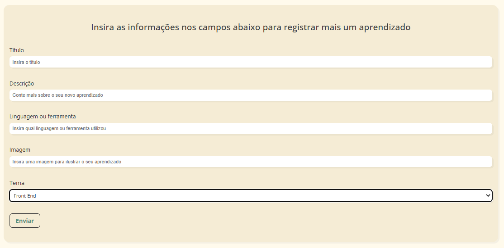
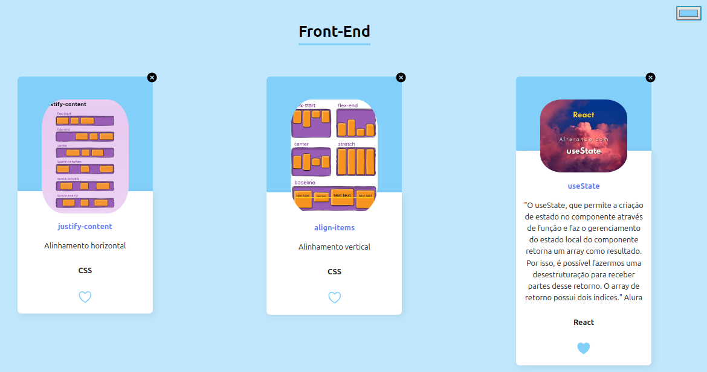

## 📔 Diário de Aprendizados

Uma aplicação para registrar os aprendizados mais importantes durante os estudos, organizados de forma prática e temática.

 

## 🚀 Sobre o Projeto

Este projeto foi desenvolvido inspirado no projeto base do curso da Alura:

* "React: desenvolvendo com JavaScript"
  
A ferramenta permite que você registre e organize os principais aprendizados adquiridos durante seus estudos, aqueles que não quer esquecer. É possível adicionar: **Título** do aprendizado; Uma **descrição** detalhada; As **linguagens ou ferramentas** utilizadas; Uma **imagem** associada; Um **tema** de estudo, selecionado por meio de uma dropdown list com opções como: Programação, Front-End, Data Science, DevOps, UX & Design, Mobile e Inovação & Gestão. Os aprendizados são organizados por temática, com cores distintas para facilitar a navegação.

## 📚 Objetivos do Curso

**👉 React: desenvolvendo com JavaScript**

* Descrever as vantagens da utilização do **React**;
* Implementar **componentes reativos**;
* Investigar e analisar **mensagens de erro**;
* Modificar e evoluir **componentes** de acordo com a necessidade do projeto;
* **Prototipar uma aplicação** do zero até o deploy.

## 🛠️ Tecnologias Utilizadas

 
          

## 🖼️ Visualização do Projeto

Uma prévia das principais funcionalidades do **Diário de Aprendizados**:

**🌐 Acesse o Projeto Online**

O projeto está disponível para visualização na **Vercel**. Clique no link abaixo para acessar:

**🖥️ Tela Inicial**

Interface principal para registrar e visualizar os aprendizados.

**✍️ Cadastro de Aprendizados**

Formulário para adicionar um novo aprendizado, incluindo título, descrição, linguagem ou ferramenta, imagem e tema.

**📚 Organização por Temas**

Exemplos dos aprendizados organizados por temática, com cores distintas para cada tema.

